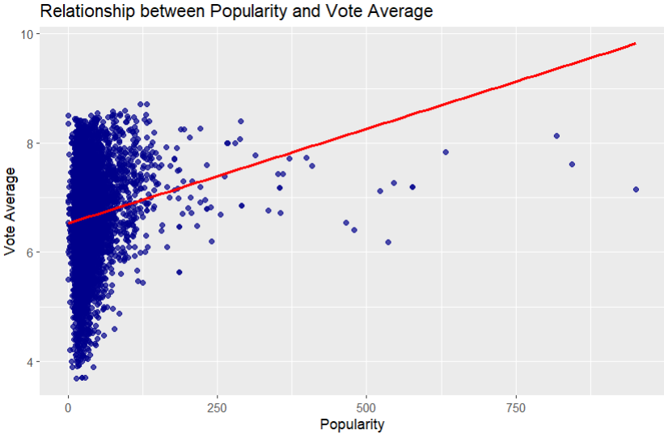

# Movie Popularity vs Vote Average Analysis

## Overview
This project explores the relationship between **movie popularity** and **vote average** using a dataset of movies. A scatter plot with a trend line was created to visualize any correlation between these two variables.

---

## Dataset
- **File Path:** `/my_dataset/movies.csv`
- **Columns of Interest:**
  - `release_date` – Date the movie was released
  - `vote_average` – Average user rating
  - `vote_count` – Total number of votes
  - `popularity` – Popularity score of the movie

---

## Setup Instructions

1. Set your working directory and load the dataset:
    ```r
    # set working directory
    # setwd(choose.dir())
    getwd()
    data <- read.csv("/my_dataset/movies.csv")
    ```

2. Inspect the dataset:
    ```r
    str(data)
    colnames(data)
    summary(data$release_date)
    summary(data$vote_average)
    summary(data$vote_count)
    summary(data$popularity)
    ```

3. Install and load necessary libraries:
    ```r
    install.packages("ggplot2")
    library(ggplot2)
    ```

---

## Analysis

A scatter plot with a linear trend line was created to examine the relationship between popularity and vote average:

```r
ggplot(data, aes(x = popularity, y = vote_average)) +
  geom_point(color = "darkblue", alpha = 0.7) +
  geom_smooth(method = "lm", se = FALSE, color = "red") +
  labs(title = "Relationship between Popularity and Vote Average",
       x = "Popularity", y = "Vote Average")
```
## Screenshots
Scatter plot with trend line showing the relationship between movie popularity and vote average:



---

## Observations
- Most movies have low popularity and are clustered on the left side of the plot.
- A few movies have very high popularity and appear far to the right.
- The red trend line slopes upward slightly, showing a small positive relationship between popularity and vote average.
- Ratings are spread out, meaning popular movies can have both high and average ratings.

---

## Conclusion
- Popularity alone is not a strong predictor of vote average. Highly popular movies do not always have the highest ratings.
- High popularity does not guarantee higher quality (as measured by vote average), and vice versa.
- Further analysis could include other variables such as genre, budget, or release year to better understand factors affecting vote average.
